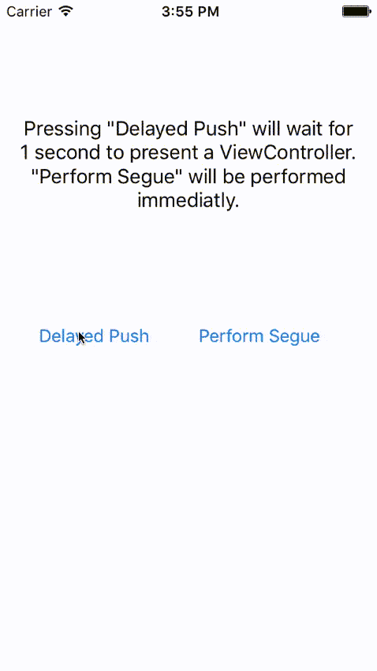

# LVModalQueue

This fixes 'NSInternalInconsistencyException's when presentViewController: and dismissViewController: are called, while a transition is already in progress. Transitions are queued for later execution.

[](https://travis-ci.org/Lovoo/LVModalQueue)
[](http://cocoapods.org/pods/LVModalQueue)
[](http://cocoapods.org/pods/LVModalQueue)
[](http://cocoapods.org/pods/LVModalQueue)

## Sample



## Installation

LVModalQueue is available through [CocoaPods](http://cocoapods.org). To install
it, simply add the following line to your Podfile:

```ruby
pod "LVModalQueue"
```

## Usage

1. Install.
2. __Thats it!__

LVModalQueue hooks into each call to _presentViewController:animated:completion:_ and _dismissViewController:animated:completion:_ and recognizes, if any previous transition has not finished yet.

## License

LVModalQueue is available under the LOVOO license. See the LICENSE file for more info.
